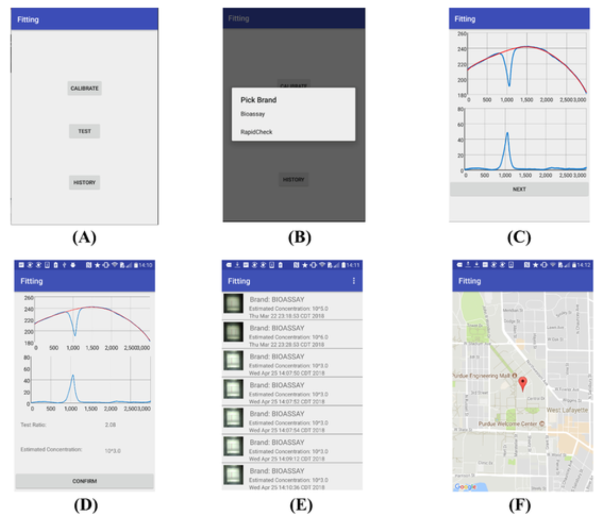

## Publication
* 1. Asadi, H., Zhou, G., **Lee, J. J.**, Aggarwal, V., & Yu, D. (2020). A computer vision approach for classifying isometric grip force exertion levels. Ergonomics, 1–17. doi: 10.1080/00140139.2020.1745898 [:page_facing_up: Paper Link](https://www.tandfonline.com/doi/figure/10.1080/00140139.2020.1745898?scroll=top&needAccess=true)

    Features: 
     

* 2. Jung, Y., Heo, Y., **Lee, J. J.**, Deering, A., & Bae, E. (2020). Smartphone-based lateral flow imaging system for detection of food-borne bacteria E.coli O157:H7. Journal of Microbiological Methods, 168, 105800. doi: 10.1016/j.mimet.2019.105800 [:page_facing_up: Paper Link](https://www.sciencedirect.com/science/article/pii/S0167701219308942?via%3Dihub)
    Screenshots: 
    

---
## Projects
### Category Name 1 

[Project 1 Title](/sample_page)

---
[Project 2 Title](/pdf/sample_presentation.pdf)

---
[Project 3 Title](http://example.com/)

---

### Category Name 2

- [Project 1 Title](http://example.com/)
- [Project 2 Title](http://example.com/)
- [Project 3 Title](http://example.com/)
- [Project 4 Title](http://example.com/)
- [Project 5 Title](http://example.com/)

---

---

Page template forked from <a href="https://github.com/evanca/quick-portfolio">evanca</a>

<!-- Remove above link if you don't want to attibute -->
